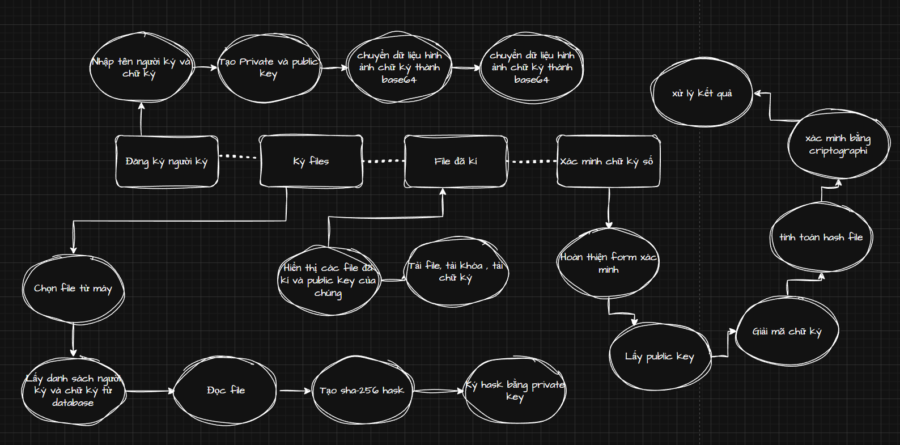
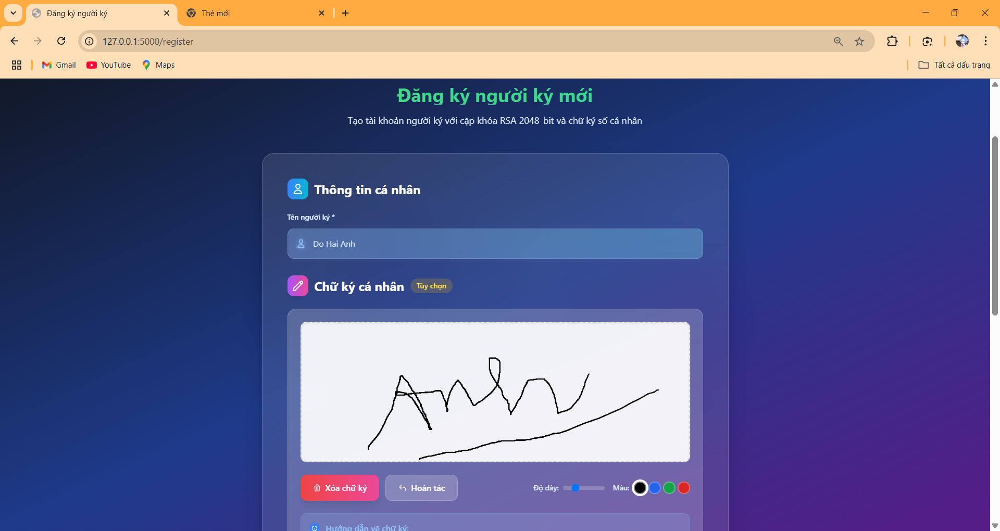
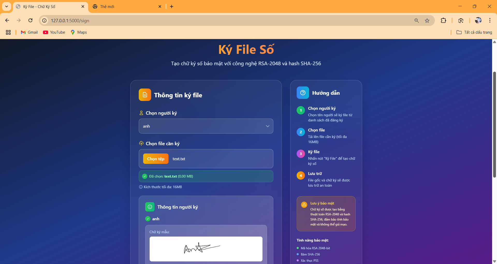
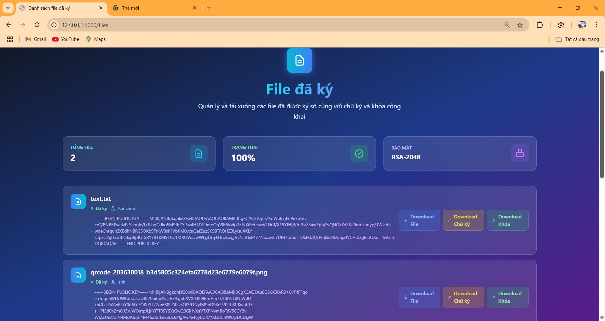

# Hệ thống chữ ký số RSA

## 📋 Tổng quan

Hệ thống chữ ký số sử dụng thuật toán RSA-PSS với hash SHA-256, cho phép người dùng tạo chữ ký số cho các file và xác minh tính toàn vẹn của chúng. Được xây dựng bằng Flask và SQLite, cung cấp giao diện web thân thiện để quản lý chữ ký số.



## ✨ Tính năng chính

- **Tạo cặp khóa RSA 2048-bit**: Tự động sinh khóa công khai và khóa riêng
- **Đăng ký người ký**: Quản lý thông tin người ký và lưu trữ chữ ký hình ảnh
- **Ký file số**: Upload và ký file với thuật toán RSA-PSS
- **Xác minh chữ ký**: Kiểm tra tính hợp lệ của chữ ký số
- **Quản lý file**: Xem danh sách file đã ký và tải xuống
- **API endpoints**: Truy xuất thông tin qua REST API

## 🔐 Công nghệ bảo mật

| Thành phần | Công nghệ | Mô tả |
|------------|-----------|-------|
| **Mã hóa** | RSA 2048-bit | Thuật toán mã hóa bất đối xứng |
| **Hash** | SHA-256 | Hàm băm mật mã học |
| **Chữ ký** | RSA-PSS | Probabilistic Signature Scheme |
| **Encoding** | Base64 | Mã hóa dữ liệu nhị phân |

## 🛠️ Cài đặt

### Yêu cầu hệ thống
```
Python 3.7+
Flask
SQLite3
Cryptography library
```

### Cài đặt dependencies
```bash
pip install flask
pip install cryptography
pip install werkzeug
```

## 🚀 Chạy ứng dụng

```bash
python app.py
```

Truy cập ứng dụng tại: `http://localhost:5000`

## 📁 Cấu trúc thư mục

```
digital-signature-system/
├── app.py                 # File chính của ứng dụng
├── digital_signature.db   # Database SQLite (tự động tạo)
├── uploads/              # Thư mục lưu file upload
├── templates/            # Templates HTML
│   ├── base.html
│   ├── index.html
│   ├── register.html
│   ├── keys.html
│   ├── sign.html
│   ├── files.html
│   └── verify.html
└── README.md
```

## 💾 Cấu trúc Database

### Bảng `signers`
| Cột | Kiểu dữ liệu | Mô tả |
|-----|-------------|-------|
| id | INTEGER PRIMARY KEY | ID tự tăng |
| name | TEXT UNIQUE | Tên người ký (duy nhất) |
| private_key | TEXT | Khóa riêng RSA (PEM format) |
| public_key | TEXT | Khóa công khai RSA (PEM format) |
| signature_image | TEXT | Hình ảnh chữ ký (tùy chọn) |
| created_at | TIMESTAMP | Thời gian tạo |

### Bảng `signed_files`
| Cột | Kiểu dữ liệu | Mô tả |
|-----|-------------|-------|
| id | INTEGER PRIMARY KEY | ID tự tăng |
| original_filename | TEXT | Tên file gốc |
| signed_filename | TEXT | Tên file đã ký |
| signature_filename | TEXT | Tên file chữ ký (.sig) |
| signer_name | TEXT | Tên người ký |
| file_hash | TEXT | Hash SHA-256 của file (base64) |
| signature_data | TEXT | Dữ liệu chữ ký (base64) |
| created_at | TIMESTAMP | Thời gian ký |

## 🔄 Luồng hoạt động

### 1. Đăng ký người ký
```
Nhập tên → Tạo cặp khóa RSA → Lưu vào database → Hiển thị khóa
```

### 2. Ký file
```
Chọn người ký → Upload file → Tạo hash SHA-256 → Ký bằng RSA-PSS → Lưu chữ ký
```

### 3. Xác minh chữ ký
```
Upload file → Nhập public key → Nhập chữ ký → Xác minh → Kết quả
```

## 📡 API Endpoints

| Endpoint | Method | Mô tả |
|----------|--------|-------|
| `/` | GET | Trang chủ |
| `/register` | GET/POST | Đăng ký người ký |
| `/keys/<name>` | GET | Xem thông tin khóa |
| `/sign` | GET/POST | Ký file |
| `/files` | GET | Danh sách file đã ký |
| `/verify` | GET/POST | Xác minh chữ ký |
| `/download/<type>/<filename>` | GET | Tải file/chữ ký |
| `/api/signer/<name>` | GET | Thông tin người ký (JSON) |


## 🛡️ Bảo mật

### Điểm mạnh:
- ✅ RSA-PSS với padding an toàn
- ✅ SHA-256 hash function
- ✅ 2048-bit key size
- ✅ Secure filename handling
- ✅ File size limitations


## 📝 Sử dụng


### 1. Tạo người ký mới
1. Truy cập `/register`
2. Nhập tên người ký
3. (Tùy chọn) Thêm hình ảnh chữ ký
4. Nhấn "Đăng ký"



### 2. Ký file
1. Truy cập `/sign`
2. Chọn người ký từ danh sách
3. Upload file cần ký
4. Nhấn "Ký file"



### 3. Xác minh chữ ký
1. Truy cập `/verify`
2. Upload file cần kiểm tra
3. Nhập/chọn public key
4. Nhập chữ ký (base64)
5. Nhấn "Xác minh"


### 4. Thông tin các files đã kí
1. Truy cập `/key`
2. Download files
3. Download chữ kí
4. Download khóa
5. Xem thông tin public key



## 🐛 Xử lý lỗi

| Lỗi | Nguyên nhân | Giải pháp |
|-----|-------------|-----------|
| "Tên này đã tồn tại" | Trùng tên người ký | Sử dụng tên khác |
| "Vui lòng chọn file" | Không upload file | Upload file hợp lệ |
| "Chữ ký không hợp lệ" | File bị thay đổi hoặc chữ ký sai | Kiểm tra lại file và chữ ký |
| "Lỗi khi ký file" | Lỗi xử lý file | Kiểm tra định dạng file |

## Test xác minh chữ ký 
1. Chọn **xác minh chữ ký**
2. Chọn tệp : [upload/text.txt]
3. Chọn người ký: [Kanchou]
4. Chọn tệp file chữ ký đã tải sẵn: [uploads/text.txt.sig]
5. Bấm xác minh chữ ký 


## 👥 Tác giả

- **Kacnhou2420** - *Initial work* - [GitHub Profile](https://github.com/kanchou2420)


**Liên hệ**: [0966826423]  
**Facebook**: [https://www.facebook.com/loi.hien.thi.579358?locale=vi_VN]  
**Gmail**: [hanh64723@gmail.com]